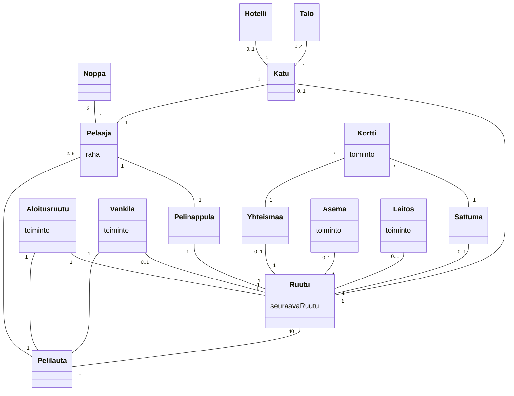

```mermaid
 classDiagram
      Ruutu "40" -- "1" Pelilauta
      Noppa "2" -- "1" Pelaaja
      Pelaaja "1" -- "1" Pelinappula
      Pelinappula "1" -- "1" Ruutu 
      Pelaaja "2..8" -- "1" Pelilauta
      Aloitusruutu "1" -- "1" Ruutu
      Vankila "0..1" -- "1" Ruutu
      Katu "0..1" -- "1" Ruutu
      Sattuma "0..1" -- "1" Ruutu
      Kortti "*" -- "1" Sattuma
      Kortti "*" -- "1" Yhteismaa
      Yhteismaa "0..1" -- "1" Ruutu
      Asema "0..1" -- "1" Ruutu
      Laitos "0..1" -- "1" Ruutu
      Talo "0..4"-- "1" Katu
      Hotelli "0..1" -- "1" Katu
      Katu "1" -- "1" Pelaaja
      Aloitusruutu "1" -- Pelilauta
      Vankila "1" -- Pelilauta
      
      class Ruutu{
      seuraavaRuutu
      }
      class Pelilauta{
      }
            class Noppa{
      }
      class Pelaaja{
      raha
      }
      class Pelinappula{
      }
      class Aloitusruutu{
      toiminto
      }
      class Vankila{
      toiminto
      }
      class Sattuma{
      
      }
      class Yhteismaa{
      
      }
      class Asema{
      toiminto
      }
      class Laitos{
      toiminto
      }
      class Talo{
      }
      class Hotelli{
      }
      class Kortti{
      toiminto
      }

      
```

